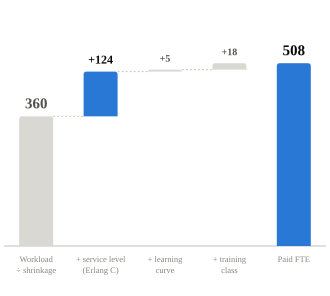
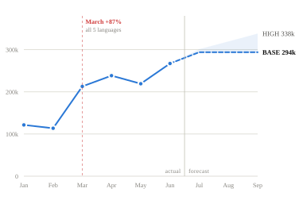
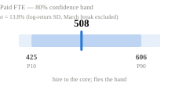
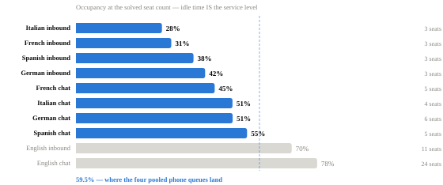
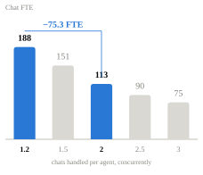
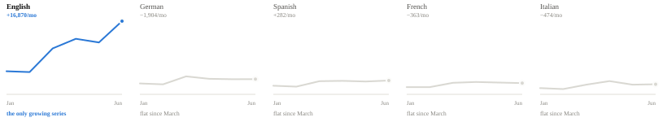

order: s1, s2, s3, s4, s5, a1, a2, a3, a4, a5, a6

<!--
GYG WFM deck — content source.

- Each slide is a `===slide: ID` ... `===` block. Reorder or delete whole
  blocks to reorder/remove slides — but also update the `order:` line above,
  that's what actually controls sequence and page numbers.
- Inside a slide, each `---col: WIDTH%---` ... starts a column. Delete a
  column to remove it (widths in a row should still add to ~100%).
- Text is plain HTML fragments (kept multi-line/indented for readability),
  the same tags/classes the deck's CSS (deck/style.css) already styles:
  h2/h3 headings, p.sm paragraphs, ul/li lists, table, span.crit/.accent/.good/.mute
  for coloured emphasis, div.note (add class red|grey for the tinted variants),
  div.tile for the small stat boxes, div.hero for the big number. Edit wording
  freely inside tags; don't rename classes unless you also touch the CSS.
- Charts are pre-rendered SVGs referenced by 
  — they're generated from the model's numbers, not hand-edited here. Deleting the
   line removes the chart from that column.
- Build the deck with: python3 deck/render_deck.py   (writes GYG_WFM_Submission.html)
  Then export a PDF with: python3 deck/render_deck.py --pdf
-->

===s1===
tag: 01 · Executive summary
title: 508 paid FTE per month to meet service level
dek: 
apx: false

---col:30%---
<h2 style="font-size:14px; color:#0b0b0b">The answer — July to September</h2>

  508
  paid FTE per month

To hold <strong>80% / 20s</strong> phone and <strong>80% / 60s</strong> chat at the June run-rate <strong>+10%</strong> seasonal uplift.

  

    

      Productive hours
    

    

      68,827
    

    

      per month — the BPO bill
    

  

  

    

      Contacts
    

    

      294k
    

    

      all languages, all channels
    

  

  <h3>One number needs an owner ±78 FTE</h3>
  
AHT assumption (709.8s, 4 channels) and Apr–Jun actuals (908.8s, ticket reasons) agree within 1% once outbound is excluded from both — <strong>this isn't AHT drift.</strong> The real question: is outbound English volume real? It mirrors inbound in 29/30 months. <strong>508 vs 585 FTE</strong>, unresolvable without an owner for outbound.

Full scenario range (LOW/HIGH) and the P10–P90 confidence band are in the appendix (A3).

---col:40%---
<h2 style="font-size:14px; color:#0b0b0b">A quarter of the requirement is service level, not workload</h2>

A workload model returns <strong>360 FTE</strong> and <strong class="crit">misses SLA</strong> — it implicitly assumes 100% occupancy. Erlang C says English inbound runs at <strong>70%</strong>; the idle 30% <em>is</em> the 20-second answer time.

---col:30%---
<h2 style="font-size:14px; color:#0b0b0b">Model architecture — one chain, two paths in</h2>

Two paths — deferred (workload) and real-time (Erlang C) — merge before shrinkage. Same chain, every language. Full formula and constants on slide 02.

===end===

===s2===
tag: 02 · Method
title: How the number is built — and what the data would not tell us
dek: 
apx: false

---col:33%---
<h2 style="font-size:14px; color:#0b0b0b">Assumptions — what we had to decide</h2>
<table style="font-size:10px; line-height:1.9">
  <tr>
    <td style="width:46%"><strong>Deferred occupancy</strong></td>
    <td class="mute">85% — not in the data, industry-typical</td>
  </tr>
  <tr>
    <td><strong>Shrinkage</strong></td>
    <td class="mute">18% flat — matches the workbook exactly</td>
  </tr>
  <tr>
    <td><strong>Attrition</strong></td>
    <td class="mute">36%/yr → 3.65%/mo, compounded</td>
  </tr>
  <tr>
    <td><strong>Seasonal uplift</strong></td>
    <td class="mute">+10% — mandated by the brief</td>
  </tr>
  <tr>
    <td><strong>Routing</strong></td>
    <td class="mute">BPO 1&amp;2 English; BPO 3 DE/IT/ES/FR</td>
  </tr>
  <tr>
    <td><strong>Chat concurrency</strong></td>
    <td class="mute">1.2 as given — open, see Q2</td>
  </tr>
  <tr class="tot">
    <td><strong>English AHT engine</strong></td>
    <td>channel-level, incl. outbound — open, see Q1</td>
  </tr>
</table>

Erlang C runs on a flat 24/7 average arrival rate — a <em>floor</em>. Real intraday peaks and overnight minimum-staffing push interval-level staffing up, never down.

---col:40%---
<h2 style="font-size:14px; color:#0b0b0b">Data quality — 12 checks, full log in appendix</h2>
<table>
  <tr>
    <td>pass</td>
    <td>English reason tickets tie to Contact Volume, all 6 months</td>
    <td class="mute">ratio exactly 1.000000 — safe to join</td>
  </tr>
  <tr>
    <td>warn</td>
    <td>Channel rows vs their own language total</td>
    <td class="mute">off by ≤2 contacts in 17/30 months — channel rows are the source of truth</td>
  </tr>
  <tr>
    <td>fix</td>
    <td>Blank reason label, 3,729 tickets</td>
    <td class="mute">relabelled "UNMAPPED", volume kept</td>
  </tr>
  <tr>
    <td>fix</td>
    <td>1 AHT outlier vs its reason median</td>
    <td class="mute">replaced with the reason's own median</td>
  </tr>
  <tr>
    <td>warn</td>
    <td>Inbound = Outbound, Email = Chat in most months</td>
    <td class="mute">synthetic mirror — kept conservatively, flagged</td>
  </tr>
  <tr>
    <td>fix</td>
    <td>SLA attainment reported at 110% in February</td>
    <td class="mute">impossible — excluded from the trend</td>
  </tr>
</table>

  
<strong>SLA attainment fell 95% → 92% while volume doubled.</strong> That is the business case for this transformation, sitting unused in the source data.

---col:27%---
<h2 style="font-size:14px; color:#0b0b0b">Two open questions, priced</h2>
<h3>1 · Is outbound English volume real?</h3>

AHT assumption (709.8s) and Apr–Jun actuals (908.8s) agree within 1% once outbound is excluded from both — not AHT drift. Outbound mirrors inbound in 29/30 months, the signature of a synthetic column. Worth 78 FTE (15%) either way.

<h3 style="margin-top:11px">2 · Is chat concurrency measured or assumed?</h3>

1.2 on every BPO and every language, under a header that says "English". Worth 75 FTE.

<h2 style="margin-top:15px">Also requested</h2>
<ul class="sm">
  <li>24+ months of history — 6 cannot support a seasonal model</li>
  <li>15/30-minute arrival data — monthly Erlang is a floor</li>
  <li>What changed in March — system, market, or demand?</li>
  <li>Cost per productive hour by BPO — to rank levers in €</li>
  <li>True outbound volumes — the mirrored columns cannot be real</li>
</ul>

  
<strong>Structural finding:</strong> 45 reason codes collapse to <strong>25</strong> distinct AHT profiles, and <strong>6</strong> of those clusters cross reason families — AHT is measured on a different taxonomy than the reason codes, and neither nests inside the other.

===end===

===s3===
tag: 03 · Task 1a — Capacity forecast
title: Forecast, capacity and the range around it
dek: 
apx: false

---col:46%---
<h2 style="font-size:14px; color:#0b0b0b">Volume — six months of actuals, three of forecast</h2>

<strong>The baseline is June, not an average.</strong> March jumps 1.6–2.1× across all five languages, every channel and all 49 reason codes at once — the signature of a system or reporting change, not real demand. We anchor on post-break months only.

<strong>BASE holds Jul–Sep flat</strong> — not a claim that demand is flat, but a refusal to invent a summer curve from six months that include a level shift. HIGH is the summer-peak case; slide 5 has the trigger to switch to it.

---col:27%---
<h2 style="font-size:14px; color:#0b0b0b">Capacity by language — BASE, per month</h2>
<table>
  <tr>
    <th>Language</th>
    <th class="n">Contacts</th>
    <th class="n">Prod h</th>
    <th class="n">Workload FTE</th>
    <th class="n">SLA FTE</th>
  </tr>
  <tr>
    <td><strong>English</strong></td>
    <td class="n">174,128</td>
    <td class="n">40,298</td>
    <td class="n">242</td>
    <td class="n"><strong>284</strong></td>
  </tr>
  <tr>
    <td><strong>German</strong></td>
    <td class="n">36,135</td>
    <td class="n">8,220</td>
    <td class="n">36</td>
    <td class="n"><strong>58</strong></td>
  </tr>
  <tr>
    <td><strong>Spanish</strong></td>
    <td class="n">32,879</td>
    <td class="n">7,133</td>
    <td class="n">31</td>
    <td class="n"><strong>50</strong></td>
  </tr>
  <tr>
    <td><strong>French</strong></td>
    <td class="n">26,662</td>
    <td class="n">6,773</td>
    <td class="n">26</td>
    <td class="n"><strong>48</strong></td>
  </tr>
  <tr>
    <td><strong>Italian</strong></td>
    <td class="n">24,066</td>
    <td class="n">6,402</td>
    <td class="n">25</td>
    <td class="n"><strong>45</strong></td>
  </tr>
  <tr class="tot">
    <td>Total</td>
    <td class="n">293,869</td>
    <td class="n">68,827</td>
    <td class="n">360</td>
    <td class="n">484</td>
  </tr>
</table>
<h2 style="margin-top:16px; font-size:14px; color:#0b0b0b">By BPO — vendor split</h2>
<table>
  <tr>
    <th>BPO</th>
    <th>Languages</th>
    <th class="n">FTE</th>
    <th class="n">Prod h</th>
  </tr>
  <tr>
    <td><strong>BPO 3</strong></td>
    <td class="mute">DE IT ES FR</td>
    <td class="n"><strong>201</strong></td>
    <td class="n">28,529</td>
  </tr>
  <tr>
    <td><strong>BPO 1</strong></td>
    <td class="mute">English 50%</td>
    <td class="n"><strong>142</strong></td>
    <td class="n">20,149</td>
  </tr>
  <tr>
    <td><strong>BPO 2</strong></td>
    <td class="mute">English 50%</td>
    <td class="n"><strong>142</strong></td>
    <td class="n">20,149</td>
  </tr>
</table>

English AHT is the BPO1/BPO2 50/50 blend, so total capacity does not depend on how English is split between the two vendors.

---col:27%---
<h2 style="font-size:14px; color:#0b0b0b">Scenarios — paid FTE</h2>
<table>
  <tr>
    <th>Case</th>
    <th class="n">Jul</th>
    <th class="n">Aug</th>
    <th class="n">Sep</th>
    <th class="n">Basis</th>
  </tr>
  <tr>
    <td><strong>LOW</strong></td>
    <td class="n">462</td>
    <td class="n">462</td>
    <td class="n">462</td>
    <td class="n mute">June run-rate, no uplift</td>
  </tr>
  <tr>
    <td><strong>BASE</strong></td>
    <td class="n">508</td>
    <td class="n">508</td>
    <td class="n">508</td>
    <td class="n mute">June × 1.10, held flat</td>
  </tr>
  <tr>
    <td><strong>HIGH</strong></td>
    <td class="n">518</td>
    <td class="n">551</td>
    <td class="n">579</td>
    <td class="n mute">English on trend × 1.10</td>
  </tr>
</table>

  
<strong>Do not hire to a point estimate.</strong> Contract a <strong>~490 FTE core</strong> and hold a cross-trained flex pool of <strong>60–100</strong> against the P90, released monthly on the re-forecast trigger.

Backfill alone runs at <strong>19 hires/month</strong> at 36% annual attrition — with a 4-week class and a 3-month ramp, recruitment must lead the forecast by a full quarter.

===end===

===s4===
tag: 04 · Task 1b — Optimisation
title: Two strategies the arithmetic supports — and one it kills
dek: 
apx: false

---col:40%---
<h2 style="font-size:13px; color:#0b0b0b">Strategy 1 · Pool the four non-English queues −51.4 FTE (10%)</h2>

<strong>The occupancy column is the finding.</strong> Those queues are not idle by choice — 80/20 on a queue of 0.84 erlangs, staffed 24/7, needs 3 seats no matter how few calls arrive. <strong>Four small queues pay that floor four times.</strong>

<table style="margin-top:10px">
  <tr>
    <th>Queue</th>
    <th class="n">Siloed</th>
    <th class="n">Pooled</th>
    <th class="n">SL</th>
    <th class="n">Saved</th>
  </tr>
  <tr>
    <td><strong>Inbound</strong> DE IT ES FR</td>
    <td class="n">12 seats</td>
    <td class="n"><strong>7</strong></td>
    <td class="n good">86%</td>
    <td class="n"><strong>25.7</strong></td>
  </tr>
  <tr>
    <td><strong>Chat</strong> DE IT ES FR</td>
    <td class="n">20 seats</td>
    <td class="n"><strong>14</strong></td>
    <td class="n good">86%</td>
    <td class="n"><strong>25.7</strong></td>
  </tr>
  <tr class="tot">
    <td>Total</td>
    <td colspan="3" class="mute" style="font-weight:400">≈ 8,900 productive hours off the BPO 3 bill</td>
    <td class="n">51.4</td>
  </tr>
</table>

---col:33%---
<h2 style="font-size:14px; color:#0b0b0b">Why it works, and what it costs</h2>

All four languages already sit in BPO 3, so this is a routing and skilling change, not a vendor change. Both pooled queues were <strong>re-solved through the same Erlang engine</strong> — the service level goes up, not down. Phase it: start with the overnight window, where the floors bite hardest.

  <h3>Tested and rejected: deflect phone → chat</h3>
  
The intuitive lever. Modelled end-to-end it <strong>costs</strong> FTE, because English chat consumes <strong>958 agent-seconds</strong> per contact against phone's <strong>458</strong>.

  <table style="margin-top:6px">
    <tr>
      <th>Shift</th>
      <th class="n">Phone</th>
      <th class="n">Chat</th>
      <th class="n">FTE</th>
      <th class="n">Δ</th>
    </tr>
    <tr>
      <td>0%</td>
      <td class="n">11</td>
      <td class="n">24</td>
      <td class="n">159.2</td>
      <td class="n mute">0.0</td>
    </tr>
    <tr>
      <td>10%</td>
      <td class="n">10</td>
      <td class="n">26</td>
      <td class="n">162.6</td>
      <td class="n crit">+3.4</td>
    </tr>
    <tr>
      <td>20%</td>
      <td class="n">9</td>
      <td class="n">28</td>
      <td class="n">166.1</td>
      <td class="n crit">+6.8</td>
    </tr>
    <tr>
      <td>30%</td>
      <td class="n">9</td>
      <td class="n">30</td>
      <td class="n">174.6</td>
      <td class="n crit">+15.4</td>
    </tr>
  </table>

---col:27%---
<h2 style="font-size:13px; color:#0b0b0b">Strategy 2 · Chat concurrency −75.3 FTE (15%)</h2>

Chat is <strong>188 FTE — 39% of the entire operation</strong>, the largest single line in the plan. The given 1.2 sits under a column headed "Chat concurrency <em>English</em>" yet repeats on every BPO and every language.

<strong>Ask whether it was measured.</strong> If it was, the tooling or the routing rules are the constraint and there is a clear case to fix them. If it is a placeholder, the plan carries a 75 FTE error. Either answer is worth having.

  
<strong>Where the real prize is.</strong> The top three handling-hour drivers — <strong>1.1 Availability</strong> (5,026 h), <strong>3.3 Meeting point</strong> (4,712 h) and <strong>3.1 Voucher not received</strong> (3,844 h, CSAT 65%) — are high-volume, low-CSAT and automatable. That is a product ask, not a scheduling change, so it sits beside these two rather than among them.

===end===

===s5===
tag: 05 · Section 2 + Task 1c
title: Leading the transformation — and how AI was actually used
dek: 
apx: false

---col:38%---
<h2>2a · 30 / 60 / 90</h2>
<h3>0–30 · Decide, then build</h3>

Four decisions gate everything downstream — none are technical: <strong>who owns the AHT definition</strong> (the ±78 FTE question is unresolvable without an owner); <strong>forecast granularity</strong> (language × channel × interval — anything coarser cannot produce an SLA-compliant number); <strong>who signs off assumptions</strong> and how often; <strong>where the model lives</strong>. Baseline the manual model's accuracy in week 1 — without it there is nothing to beat.

<h3 style="margin-top:9px">31–60 · Shadow, don't switch</h3>

New model runs in parallel on English — 59% of volume, all of the growth, all of the forecast risk (σ 19.5% vs under 9% elsewhere). Weekly reconciliation against the manual plan. The manual plan stays <em>the</em> plan.

<h3 style="margin-top:9px">61–90 · Cut over, then extend</h3>

English cuts over once it has beaten the baseline for six consecutive weeks. DE/IT/ES/FR follow. Escalation and override rules written down before, not after.

  
<strong>"Done" at 90 days:</strong> the model produces the weekly plan unaided, beats the manual baseline on MAPE for six straight weeks, the three specialists run it without me, and every assumption is versioned and dated.

---col:24%---
<h2>2b · Bringing three specialists along</h2>

<strong>Assess with an artefact, not an opinion.</strong> Give all three the same task on this dataset — clean it, forecast one language, document the assumptions. What comes back places them on forecasting depth × AI fluency far better than a conversation does.

<strong>Set the expectation explicitly:</strong> AI is the tool, they own the judgement. The two things AI got wrong in this exercise were both plausible-sounding domain defaults — exactly what an expert reviewer catches and a novice ships.

<strong>Protect BAU:</strong> six weeks of shadow running, paired shadowing, and a written prompt playbook. Capability is built <em>alongside</em> the plan, never instead of it.

<h2 style="margin-top:14px">2c · What I would measure</h2>

<strong>Leading</strong> — inputs with a named owner and a dated assumption · time to produce a plan · % of runs reproducible from source · open data-quality items (<strong>starts at 12</strong>) · specialists running it solo (0 → 3).

<strong>Lagging</strong> — forecast MAPE <em>and BIAS</em> by language · SLA attainment (baseline <strong>92%, falling</strong>) · FTE plan-vs-actual · shrinkage by bucket · cost per contact.

  
<strong>Lead with bias, not accuracy.</strong> Accuracy hides direction, and direction is what a workload-only model gets wrong — it is short by 34%, every single month.

---col:38%---
<h2>1c · How AI was used — and where it was wrong</h2>
<table>
  <tr>
    <th style="width:26%">Where</th>
    <th style="width:16%">Verdict</th>
    <th>What happened</th>
  </tr>
  <tr>
    <td><strong>Sheet parsing, anomaly sweep, reconciliation</strong></td>
    <td>accepted</td>
    <td class="mute">Deterministic Python. I verified the cross-sheet reconciliation independently.</td>
  </tr>
  <tr>
    <td><strong>Erlang C implementation</strong></td>
    <td>accepted</td>
    <td class="mute">After checking it by hand and against a simulation. Never ship a staffing formula you have not verified.</td>
  </tr>
  <tr>
    <td><strong>First-pass model structure</strong></td>
    <td>rejected</td>
    <td class="mute">Produced workload ÷ shrinkage <em>and</em> a separate Erlang table that never met. Meets the brief only once occupancy feeds the FTE.</td>
  </tr>
  <tr>
    <td><strong>"Deflect phone → chat"</strong></td>
    <td>rejected</td>
    <td class="mute">Generic WFM instinct contradicted by this dataset's AHTs. Caught by modelling it, not by reading it.</td>
  </tr>
  <tr>
    <td><strong>Reason-taxonomy clustering</strong></td>
    <td>changed</td>
    <td class="mute">Concluded "AHT is family-level"; testing showed clusters cross families in 6 of 11 groups.</td>
  </tr>
  <tr>
    <td><strong>Narrative drafting</strong></td>
    <td>changed</td>
    <td class="mute">Defaulted to hedging. An ops audience needs a number and a recommendation.</td>
  </tr>
</table>

  
<strong>What I would do differently.</strong> State the acceptance test <em>before</em> generating — "the FTE number must satisfy the SLA constraint" — rather than reviewing after. AI is reliable at parsing, arithmetic and structure, and unreliable at knowing <strong>which of two conflicting numbers in a workbook is the real one</strong>. That gap is a judgement call requiring the business, and no amount of prompting closes it.

Tools: Claude (Opus 5) in Claude Code for the analysis, the Python model and this deck. The verification suite found <strong>three real defects in my own model</strong> — a growth test that flagged a declining language as growing, a HIGH scenario that could land below BASE, and a mis-reported trend slope — all fixed at source.

===end===

===a1===
tag: Appendix A1
title: Every queue, end to end — BASE, July
dek: The full working behind slide 3. Occupancy below 100% on the Erlang rows is the cost of the service level.
apx: true

---col:68%---
<table class="dense">
  <tr>
    <th>Language</th>
    <th>Channel</th>
    <th class="n">Contacts</th>
    <th class="n">AHT s</th>
    <th>Model</th>
    <th class="n">Erlangs</th>
    <th class="n">Seats</th>
    <th class="n">FTE-eq seats</th>
    <th class="n">Occ</th>
    <th class="n">Achieved SL</th>
    <th class="n">Workload h</th>
    <th class="n">Productive h</th>
    <th class="n">Workload FTE</th>
    <th class="n">SLA FTE</th>
  </tr>
  <tr>
    <td><strong>English</strong></td>
    <td>Chat</td>
    <td class="n">42,882</td>
    <td class="n">1,150</td>
    <td class="mute">Erlang C</td>
    <td class="n">18.77</td>
    <td class="n">24</td>
    <td class="n">20.0</td>
    <td class="n">78%</td>
    <td class="n">86.2%</td>
    <td class="n">13,699</td>
    <td class="n">14,600</td>
    <td class="n">96.4</td>
    <td class="n"><strong>102.7</strong></td>
  </tr>
  <tr>
    <td><strong>English</strong></td>
    <td>Email</td>
    <td class="n">42,882</td>
    <td class="n">1,150</td>
    <td class="mute">deferred</td>
    <td class="n">—</td>
    <td class="n">—</td>
    <td class="n">22.1</td>
    <td class="n">85%</td>
    <td class="n">—</td>
    <td class="n">13,699</td>
    <td class="n">16,116</td>
    <td class="n">96.4</td>
    <td class="n"><strong>113.4</strong></td>
  </tr>
  <tr>
    <td><strong>English</strong></td>
    <td>Inbound</td>
    <td class="n">44,182</td>
    <td class="n">458</td>
    <td class="mute">Erlang C</td>
    <td class="n">7.69</td>
    <td class="n">11</td>
    <td class="n">11.0</td>
    <td class="n">70%</td>
    <td class="n">82.6%</td>
    <td class="n">5,615</td>
    <td class="n">8,030</td>
    <td class="n">39.5</td>
    <td class="n"><strong>56.5</strong></td>
  </tr>
  <tr>
    <td><strong>English</strong></td>
    <td>Outbound</td>
    <td class="n">44,182</td>
    <td class="n">108</td>
    <td class="mute">deferred</td>
    <td class="n">—</td>
    <td class="n">—</td>
    <td class="n">2.1</td>
    <td class="n">85%</td>
    <td class="n">—</td>
    <td class="n">1,319</td>
    <td class="n">1,552</td>
    <td class="n">9.3</td>
    <td class="n"><strong>10.9</strong></td>
  </tr>
  <tr>
    <td><strong>French</strong></td>
    <td>Chat</td>
    <td class="n">6,566</td>
    <td class="n">900</td>
    <td class="mute">Erlang C</td>
    <td class="n">2.25</td>
    <td class="n">5</td>
    <td class="n">4.2</td>
    <td class="n">45%</td>
    <td class="n">92.5%</td>
    <td class="n">1,641</td>
    <td class="n">3,042</td>
    <td class="n">11.5</td>
    <td class="n"><strong>21.4</strong></td>
  </tr>
  <tr>
    <td><strong>French</strong></td>
    <td>Email</td>
    <td class="n">6,566</td>
    <td class="n">600</td>
    <td class="mute">deferred</td>
    <td class="n">—</td>
    <td class="n">—</td>
    <td class="n">1.8</td>
    <td class="n">85%</td>
    <td class="n">—</td>
    <td class="n">1,094</td>
    <td class="n">1,287</td>
    <td class="n">7.7</td>
    <td class="n"><strong>9.1</strong></td>
  </tr>
  <tr>
    <td><strong>French</strong></td>
    <td>Inbound</td>
    <td class="n">6,765</td>
    <td class="n">360</td>
    <td class="mute">Erlang C</td>
    <td class="n">0.93</td>
    <td class="n">3</td>
    <td class="n">3.0</td>
    <td class="n">31%</td>
    <td class="n">93.3%</td>
    <td class="n">677</td>
    <td class="n">2,190</td>
    <td class="n">4.8</td>
    <td class="n"><strong>15.4</strong></td>
  </tr>
  <tr>
    <td><strong>French</strong></td>
    <td>Outbound</td>
    <td class="n">6,765</td>
    <td class="n">115</td>
    <td class="mute">deferred</td>
    <td class="n">—</td>
    <td class="n">—</td>
    <td class="n">0.3</td>
    <td class="n">85%</td>
    <td class="n">—</td>
    <td class="n">216</td>
    <td class="n">254</td>
    <td class="n">1.5</td>
    <td class="n"><strong>1.8</strong></td>
  </tr>
  <tr>
    <td><strong>German</strong></td>
    <td>Chat</td>
    <td class="n">8,899</td>
    <td class="n">900</td>
    <td class="mute">Erlang C</td>
    <td class="n">3.05</td>
    <td class="n">6</td>
    <td class="n">5.0</td>
    <td class="n">51%</td>
    <td class="n">91.3%</td>
    <td class="n">2,225</td>
    <td class="n">3,650</td>
    <td class="n">15.7</td>
    <td class="n"><strong>25.7</strong></td>
  </tr>
  <tr>
    <td><strong>German</strong></td>
    <td>Email</td>
    <td class="n">8,899</td>
    <td class="n">700</td>
    <td class="mute">deferred</td>
    <td class="n">—</td>
    <td class="n">—</td>
    <td class="n">2.8</td>
    <td class="n">85%</td>
    <td class="n">—</td>
    <td class="n">1,730</td>
    <td class="n">2,036</td>
    <td class="n">12.2</td>
    <td class="n"><strong>14.3</strong></td>
  </tr>
  <tr>
    <td><strong>German</strong></td>
    <td>Inbound</td>
    <td class="n">9,168</td>
    <td class="n">360</td>
    <td class="mute">Erlang C</td>
    <td class="n">1.26</td>
    <td class="n">3</td>
    <td class="n">3.0</td>
    <td class="n">42%</td>
    <td class="n">85.7%</td>
    <td class="n">917</td>
    <td class="n">2,190</td>
    <td class="n">6.5</td>
    <td class="n"><strong>15.4</strong></td>
  </tr>
  <tr>
    <td><strong>German</strong></td>
    <td>Outbound</td>
    <td class="n">9,168</td>
    <td class="n">115</td>
    <td class="mute">deferred</td>
    <td class="n">—</td>
    <td class="n">—</td>
    <td class="n">0.5</td>
    <td class="n">85%</td>
    <td class="n">—</td>
    <td class="n">293</td>
    <td class="n">345</td>
    <td class="n">2.1</td>
    <td class="n"><strong>2.4</strong></td>
  </tr>
  <tr>
    <td><strong>Italian</strong></td>
    <td>Chat</td>
    <td class="n">5,927</td>
    <td class="n">900</td>
    <td class="mute">Erlang C</td>
    <td class="n">2.03</td>
    <td class="n">4</td>
    <td class="n">3.3</td>
    <td class="n">51%</td>
    <td class="n">84.1%</td>
    <td class="n">1,482</td>
    <td class="n">2,433</td>
    <td class="n">10.4</td>
    <td class="n"><strong>17.1</strong></td>
  </tr>
  <tr>
    <td><strong>Italian</strong></td>
    <td>Email</td>
    <td class="n">5,927</td>
    <td class="n">800</td>
    <td class="mute">deferred</td>
    <td class="n">—</td>
    <td class="n">—</td>
    <td class="n">2.1</td>
    <td class="n">85%</td>
    <td class="n">—</td>
    <td class="n">1,317</td>
    <td class="n">1,549</td>
    <td class="n">9.3</td>
    <td class="n"><strong>10.9</strong></td>
  </tr>
  <tr>
    <td><strong>Italian</strong></td>
    <td>Inbound</td>
    <td class="n">6,106</td>
    <td class="n">360</td>
    <td class="mute">Erlang C</td>
    <td class="n">0.84</td>
    <td class="n">3</td>
    <td class="n">3.0</td>
    <td class="n">28%</td>
    <td class="n">94.8%</td>
    <td class="n">611</td>
    <td class="n">2,190</td>
    <td class="n">4.3</td>
    <td class="n"><strong>15.4</strong></td>
  </tr>
  <tr>
    <td><strong>Italian</strong></td>
    <td>Outbound</td>
    <td class="n">6,106</td>
    <td class="n">115</td>
    <td class="mute">deferred</td>
    <td class="n">—</td>
    <td class="n">—</td>
    <td class="n">0.3</td>
    <td class="n">85%</td>
    <td class="n">—</td>
    <td class="n">195</td>
    <td class="n">229</td>
    <td class="n">1.4</td>
    <td class="n"><strong>1.6</strong></td>
  </tr>
  <tr>
    <td><strong>Spanish</strong></td>
    <td>Chat</td>
    <td class="n">8,097</td>
    <td class="n">900</td>
    <td class="mute">Erlang C</td>
    <td class="n">2.77</td>
    <td class="n">5</td>
    <td class="n">4.2</td>
    <td class="n">55%</td>
    <td class="n">84.2%</td>
    <td class="n">2,024</td>
    <td class="n">3,042</td>
    <td class="n">14.2</td>
    <td class="n"><strong>21.4</strong></td>
  </tr>
  <tr>
    <td><strong>Spanish</strong></td>
    <td>Email</td>
    <td class="n">8,097</td>
    <td class="n">600</td>
    <td class="mute">deferred</td>
    <td class="n">—</td>
    <td class="n">—</td>
    <td class="n">2.2</td>
    <td class="n">85%</td>
    <td class="n">—</td>
    <td class="n">1,350</td>
    <td class="n">1,588</td>
    <td class="n">9.5</td>
    <td class="n"><strong>11.2</strong></td>
  </tr>
  <tr>
    <td><strong>Spanish</strong></td>
    <td>Inbound</td>
    <td class="n">8,342</td>
    <td class="n">360</td>
    <td class="mute">Erlang C</td>
    <td class="n">1.14</td>
    <td class="n">3</td>
    <td class="n">3.0</td>
    <td class="n">38%</td>
    <td class="n">88.7%</td>
    <td class="n">834</td>
    <td class="n">2,190</td>
    <td class="n">5.9</td>
    <td class="n"><strong>15.4</strong></td>
  </tr>
  <tr>
    <td><strong>Spanish</strong></td>
    <td>Outbound</td>
    <td class="n">8,342</td>
    <td class="n">115</td>
    <td class="mute">deferred</td>
    <td class="n">—</td>
    <td class="n">—</td>
    <td class="n">0.4</td>
    <td class="n">85%</td>
    <td class="n">—</td>
    <td class="n">266</td>
    <td class="n">314</td>
    <td class="n">1.9</td>
    <td class="n"><strong>2.2</strong></td>
  </tr>
  <tr class="tot">
    <td>Total</td>
    <td></td>
    <td class="n">293,869</td>
    <td></td>
    <td></td>
    <td></td>
    <td></td>
    <td></td>
    <td></td>
    <td></td>
    <td class="n">51,203</td>
    <td class="n">68,827</td>
    <td class="n">360.2</td>
    <td class="n">484.2</td>
  </tr>
</table>

---col:32%---
<h2>Where the 484 FTE sits</h2>

<strong>Chat is the single largest line at 39%</strong>, which is why concurrency is the biggest available lever.

<strong>Outbound is 4%</strong> despite carrying a quarter of all contacts — its AHT is 107s against email's 1,150s. That is also why the mirrored outbound column matters far less to capacity than it does to data credibility.

<strong>Email at 159 FTE is modelled as deferred work</strong> at 85% planned occupancy — an explicit assumption, not from the workbook. An 80%-in-120-minute target is close to real-time, so if the business treats email as a live queue rather than a backlog, this line grows.

  
The <strong>deferred</strong> rows carry no Erlang figures by design: a 120-minute target is a backlog commitment, not a queue discipline, so seats are derived from hours and planned occupancy instead.

===end===

===a2===
tag: Appendix A2
title: Data-quality log — all 12 checks
dek: Condensed to five rows on slide 2. This is the full log, including the checks that passed.
apx: true

---full---
<table class="dense">
  <tr>
    <th class="n" style="width:2%">#</th>
    <th style="width:5%">Status</th>
    <th style="width:17%">Check</th>
    <th style="width:28%">Finding</th>
    <th style="width:26%">Decision</th>
    <th>Capacity impact</th>
  </tr>
  <tr>
    <td class="n mute">1</td>
    <td>warn</td>
    <td><strong>channel rows sum to language total</strong></td>
    <td class="mute">17/30 language-months disagree with their own 'Tot' row; max 2 contacts (0.0120% of the total)</td>
    <td>rounding residue in synthetic data. Channel rows are the source of truth (each has its own AHT and SLA); language totals are derived from them</td>
    <td class="mute">&lt;0.0120% of volume - immaterial to capacity</td>
  </tr>
  <tr>
    <td class="n mute">2</td>
    <td>pass</td>
    <td><strong>EN CSAT reason tickets tie to Contact Volume English total</strong></td>
    <td class="mute">max |ratio - 1| = 0.00e+00 across 6 months (ratios 1.000000, 1.000000, 1.000000, 1.000000, 1.000000, 1.000000)</td>
    <td>the two sheets describe the same population - safe to join</td>
    <td class="mute">validates the reason-mix join used for AHT weighting</td>
  </tr>
  <tr>
    <td class="n mute">3</td>
    <td>fix</td>
    <td><strong>CSAT reported against zero tickets</strong></td>
    <td class="mute">3 reason-months carry a CSAT score with 0 tickets (e.g. 18.2. Positive feedback / February -&gt; CSAT 88)</td>
    <td>null the CSAT; keep the row so the ticket series stays complete</td>
    <td class="mute">none - CSAT is not a capacity input</td>
  </tr>
  <tr>
    <td class="n mute">4</td>
    <td>fix</td>
    <td><strong>reason label missing</strong></td>
    <td class="mute">one reason row has a blank label carrying 3,729 tickets (0.63% of English volume)</td>
    <td>relabel 'UNMAPPED' and KEEP the volume - it is real contact demand</td>
    <td class="mute">0.63% of English volume would be lost if dropped</td>
  </tr>
  <tr>
    <td class="n mute">5</td>
    <td>fix</td>
    <td><strong>AHT outliers vs reason median</strong></td>
    <td class="mute">1 reason-months outside 0.5x-2.0x their own median; worst: 1.4. Pricing June = 271s vs median 1408s</td>
    <td>replace with the reason's own median</td>
    <td class="mute">&lt;0.5% of the English weighted AHT</td>
  </tr>
  <tr>
    <td class="n mute">6</td>
    <td>warn</td>
    <td><strong>channel pair Inbound == Outbound</strong></td>
    <td class="mute">identical in 29/30 language-months</td>
    <td>synthetic mirror - keep as-is (conservative), flag in assumptions</td>
    <td class="mute">outbound volume is not credible; ~8 FTE over-stated if true outbound is ~10% of inbound (AHT 107s, so the exposure is small)</td>
  </tr>
  <tr>
    <td class="n mute">7</td>
    <td>warn</td>
    <td><strong>channel pair Email == Chat</strong></td>
    <td class="mute">identical in 23/30 language-months</td>
    <td>synthetic mirror - keep as-is (conservative), flag in assumptions</td>
    <td class="mute">channel split is fabricated, but email/chat AHT are close (1,150 vs 1,150 EN) so the capacity exposure is minimal</td>
  </tr>
  <tr>
    <td class="n mute">8</td>
    <td>warn</td>
    <td><strong>BPO x language routing constraint</strong></td>
    <td class="mute">9 of 15 rows violate 'Other information' B5/B6 (e.g. ('BPO 1', 'French'))</td>
    <td>drop unroutable rows before any AHT lookup</td>
    <td class="mute">none if dropped; wrong-language AHT if not</td>
  </tr>
  <tr>
    <td class="n mute">9</td>
    <td>pass</td>
    <td><strong>shrinkage components sum to Tot Shrink</strong></td>
    <td class="mute">max |Tot Shrink - sum(components)| = 0.00e+00 over 15 language-BPO pairs; Tot Shrink is 18%-18% everywhere</td>
    <td>use Tot Shrink = 18%; keep the breakdown for the optimisation case</td>
    <td class="mute"></td>
  </tr>
  <tr>
    <td class="n mute">10</td>
    <td>warn</td>
    <td><strong>structural break in the volume series</strong></td>
    <td class="mute">March: +87% MoM; all 5 languages move together (1.60x-2.06x)</td>
    <td>treat as a level shift, not seasonality - anchor the baseline on post-break months only</td>
    <td class="mute">determines the forecast baseline</td>
  </tr>
  <tr>
    <td class="n mute">11</td>
    <td>fix</td>
    <td><strong>SLA attainment series within [0,1]</strong></td>
    <td class="mute">1 month(s) report &gt;100% attainment (February 110%)</td>
    <td>exclude the impossible month from the attainment trend</td>
    <td class="mute">reporting only - not a capacity input</td>
  </tr>
  <tr>
    <td class="n mute">12</td>
    <td>warn</td>
    <td><strong>SLA attainment trend</strong></td>
    <td class="mute">attainment moves 95% -&gt; 92% (-3%) while volume grows - the current manual model is under-forecasting</td>
    <td>use as the business case for the transformation</td>
    <td class="mute">evidence, not an input</td>
  </tr>
</table>

<strong>Grading matters.</strong> A ±2-contact rounding residue and a 110% SLA reading are both "wrong", but only one changes a decision. Every row above carries its own materiality, so the reader can see which findings were acted on and which were merely noted.

===end===

===a3===
tag: Appendix A3
title: Forecast detail — why only English gets a trend
dek: 
apx: true

---full---

---col:46%---
<h2>Per-language growth test — post-break window</h2>
<table>
  <tr>
    <th>Language</th>
    <th class="n">June</th>
    <th class="n">Mar→Jun</th>
    <th class="n">OLS slope /month</th>
    <th class="n">R²</th>
    <th class="n">σ</th>
    <th>Growing?</th>
  </tr>
  <tr>
    <td><strong>English</strong></td>
    <td class="n">158,298</td>
    <td class="n">+59.3%</td>
    <td class="n">+16,870</td>
    <td class="n">0.74</td>
    <td class="n">19.5%</td>
    <td><strong class='accent'>yes</strong></td>
  </tr>
  <tr>
    <td><strong>German</strong></td>
    <td class="n">32,850</td>
    <td class="n">-15.7%</td>
    <td class="n">-1,904</td>
    <td class="n">0.68</td>
    <td class="n">6.9%</td>
    <td>no</td>
  </tr>
  <tr>
    <td><strong>Spanish</strong></td>
    <td class="n">29,890</td>
    <td class="n">+5.1%</td>
    <td class="n">+282</td>
    <td class="n">0.15</td>
    <td class="n">8.3%</td>
    <td>no</td>
  </tr>
  <tr>
    <td><strong>French</strong></td>
    <td class="n">24,238</td>
    <td class="n">-3.2%</td>
    <td class="n">-363</td>
    <td class="n">0.19</td>
    <td class="n">5.6%</td>
    <td>no</td>
  </tr>
  <tr>
    <td><strong>Italian</strong></td>
    <td class="n">21,878</td>
    <td class="n">+4.6%</td>
    <td class="n">-474</td>
    <td class="n">0.03</td>
    <td class="n">27.1%</td>
    <td>no</td>
  </tr>
</table>

A language earns the trend extrapolation in HIGH only if its slope is <strong>positive</strong>, exceeds 3% of baseline, and fits at R² &gt; 0.4. Only English qualifies. An earlier version of this test keyed off the absolute slope, which flagged <em>declining</em> German as growing and produced a HIGH case below BASE — caught by the verification suite.

---col:26%---
<h2>Confidence band — July</h2>
<table>
  <tr>
    <th>Pctile</th>
    <th class="n">Mult</th>
    <th class="n">Contacts</th>
    <th class="n">Paid FTE</th>
  </tr>
  <tr>
    <td>P5</td>
    <td class="n">0.797</td>
    <td class="n">234,264</td>
    <td class="n">405</td>
  </tr>
  <tr>
    <td>P10</td>
    <td class="n">0.838</td>
    <td class="n">246,292</td>
    <td class="n">425</td>
  </tr>
  <tr>
    <td>P25</td>
    <td class="n">0.911</td>
    <td class="n">267,784</td>
    <td class="n">463</td>
  </tr>
  <tr>
    <td>P50</td>
    <td class="n">1.000</td>
    <td class="n">293,869</td>
    <td class="n tot">508</td>
  </tr>
  <tr>
    <td>P75</td>
    <td class="n">1.097</td>
    <td class="n">322,496</td>
    <td class="n">557</td>
  </tr>
  <tr>
    <td>P90</td>
    <td class="n">1.193</td>
    <td class="n">350,638</td>
    <td class="n">606</td>
  </tr>
  <tr>
    <td>P95</td>
    <td class="n">1.254</td>
    <td class="n">368,641</td>
    <td class="n">637</td>
  </tr>
</table>

Log-normal around the BASE median, σ = 13.8% from month-over-month log returns with the March break excluded. FTE is linear in volume, so the same multipliers carry through.

---col:28%---
<h2>Monthly re-forecast trigger</h2>
<table>
  <tr>
    <th>Signal</th>
    <th>Threshold</th>
    <th>Action</th>
  </tr>
  <tr>
    <td>English vs BASE</td>
    <td class="mute">&gt; +8%, 2 weeks</td>
    <td>Switch to HIGH; release flex pool</td>
  </tr>
  <tr>
    <td>English vs BASE</td>
    <td class="mute">&lt; −8%, 2 weeks</td>
    <td>Switch to LOW; freeze pipeline</td>
  </tr>
  <tr>
    <td>SLA attainment</td>
    <td class="mute">&lt; 90%, 2 weeks</td>
    <td>Immediate re-forecast</td>
  </tr>
  <tr>
    <td>AHT drift</td>
    <td class="mute">±5% vs plan</td>
    <td>Re-baseline AHT, not volume</td>
  </tr>
</table>

  
The SLA trigger already fired — <strong>May came in at 90%</strong>. A model that only produces a number, without the rule for when the number is wrong, is not operational.

===end===

===a4===
tag: Appendix A4
title: Why service level costs 34% — the Erlang mechanics
dek: 
apx: true

---col:34%---
<h2>The mistake worth understanding</h2>

A workload model divides work by time and calls the result headcount. That is correct only if every agent is busy every second. <strong>No queue with a service-level target can run that way</strong> — to answer 80% of calls within 20 seconds, somebody has to be free when the call lands. The idle time is not waste; it is the product.

<table style="margin-top:10px">
  <tr>
    <th>English inbound, BASE July</th>
    <th class="n"></th>
  </tr>
  <tr>
    <td>Contacts</td>
    <td class="n">44,182</td>
  </tr>
  <tr>
    <td>AHT (BPO1/2 blend)</td>
    <td class="n">457.5 s</td>
  </tr>
  <tr>
    <td>Workload hours</td>
    <td class="n">5,615</td>
  </tr>
  <tr>
    <td>Offered load</td>
    <td class="n">7.69 erlangs</td>
  </tr>
  <tr>
    <td>Seats for 80/20</td>
    <td class="n"><strong>11</strong></td>
  </tr>
  <tr>
    <td>Achieved service level</td>
    <td class="n good">82.6%</td>
  </tr>
  <tr>
    <td>Occupancy at 11 seats</td>
    <td class="n accent">69.9%</td>
  </tr>
  <tr>
    <td class="mute">Workload FTE (÷ shrinkage only)</td>
    <td class="n mute">39.5</td>
  </tr>
  <tr class="tot">
    <td>FTE that actually meets SLA</td>
    <td class="n">56.5</td>
  </tr>
</table>

<strong>+43% on one queue.</strong> Across all ten real-time queues it is +34% on the total — the gap between a plan that hits SLA and one that does not.

---col:33%---
<h2>Why small queues cost so much more</h2>

Occupancy is not a property of the agents — it is a property of the <em>queue size</em>. A large queue smooths its own arrivals; a small one cannot, so it must hold spare seats against randomness that a bigger pool would absorb.

<table style="margin-top:9px">
  <tr>
    <th>Queue</th>
    <th class="n">Erlangs</th>
    <th class="n">Seats</th>
    <th class="n">Occupancy</th>
  </tr>
  <tr>
    <td>Italian inbound</td>
    <td class="n">0.84</td>
    <td class="n">3</td>
    <td class="n crit">27.9%</td>
  </tr>
  <tr>
    <td>French inbound</td>
    <td class="n">0.93</td>
    <td class="n">3</td>
    <td class="n crit">30.9%</td>
  </tr>
  <tr>
    <td>Spanish inbound</td>
    <td class="n">1.14</td>
    <td class="n">3</td>
    <td class="n">38.1%</td>
  </tr>
  <tr>
    <td>German inbound</td>
    <td class="n">1.26</td>
    <td class="n">3</td>
    <td class="n">41.9%</td>
  </tr>
  <tr class="tot">
    <td>All four, pooled</td>
    <td class="n">4.16</td>
    <td class="n">7</td>
    <td class="n good">59.5%</td>
  </tr>
  <tr>
    <td>English inbound</td>
    <td class="n">7.69</td>
    <td class="n">11</td>
    <td class="n">69.9%</td>
  </tr>
</table>

This is the whole argument for Strategy 1, and it is invisible to a workload model — which would report these five queues as equally efficient per contact.

  
<strong>Doubling volume does not double FTE.</strong> The verification suite checks this directly: 2× the contacts needs <strong>1.81×</strong> the FTE. Scale is a real economy in this model, which is exactly why pooling pays.

---col:33%---
<h2>Where this model is deliberately conservative</h2>
<ul class="sm">
  <li><strong>Monthly-average arrival rates.</strong> Erlang is run on a flat 24/7 rate. Real intraday peaks and overnight minimum-staffing floors make interval-level staffing <em>higher</em>, never lower. <strong>508 is a floor.</strong></li>
  <li><strong>Shrinkage held flat at 18%.</strong> BPO 3 carries 7% vacation and Jul–Sep is peak holiday. A +1–2 point summer adjustment adds 6–12 FTE (see sensitivity below).</li>
  <li><strong>Outbound kept at face value</strong> despite mirroring inbound exactly. Removing it would cut ~8 FTE; keeping it is the conservative call.</li>
  <li><strong>Email at 85% planned occupancy</strong> — an assumption, not from the data.</li>
</ul>
<h2 style="margin-top:14px">Shrinkage sensitivity</h2>
<table>
  <tr>
    <th>Total shrinkage</th>
    <th class="n">SLA FTE</th>
    <th class="n">Δ</th>
  </tr>
  <tr>
    <td>16%</td>
    <td class="n">472.7</td>
    <td class="n mute">−11.5</td>
  </tr>
  <tr>
    <td>17%</td>
    <td class="n">478.4</td>
    <td class="n mute">−5.8</td>
  </tr>
  <tr class="tot">
    <td>18% — as given</td>
    <td class="n">484.2</td>
    <td class="n">—</td>
  </tr>
  <tr>
    <td>19%</td>
    <td class="n">490.2</td>
    <td class="n crit">+6.0</td>
  </tr>
  <tr>
    <td>20%</td>
    <td class="n">496.3</td>
    <td class="n crit">+12.1</td>
  </tr>
</table>

Controllable buckets (break + lunch 6%, meetings 1%, coaching 1%) total <strong>8 points</strong>; vacation and sick are entitlement. "Cut shrinkage" is generic — <strong>"reclaim 1–2 points from break scheduling and move coaching to low-demand hours"</strong> is worth 6–12 FTE and is actionable this quarter.

  
Note the vendor difference the flat 18% hides: <strong>BPO 3 carries 7% vacation and 3% sick; BPO 1 and 2 carry 5% each.</strong> Same total, different labour model — and BPO 3's vacation line is the one that rises in the quarter being planned.

===end===

===a5===
tag: Appendix A5
title: The model and how it was verified
dek: 
apx: true

---col:32%---
<h2>The model</h2>
<table style="font-size:8px">
  <tr>
    <th style="width:38%">Module</th>
    <th>Responsibility</th>
  </tr>
  <tr>
    <td><strong>config.py</strong></td>
    <td class="mute">Every assumption in one frozen dataclass — nothing hard-coded downstream</td>
  </tr>
  <tr>
    <td><strong>erlang.py</strong></td>
    <td class="mute">Erlang B/C, service level, ASA, staffing solver, normal inverse CDF</td>
  </tr>
  <tr>
    <td><strong>loader.py</strong></td>
    <td class="mute">Schema-driven reader; refuses the hidden sheet; finds languages and channels by pattern, not cell address</td>
  </tr>
  <tr>
    <td><strong>clean.py</strong></td>
    <td class="mute">12 data-quality checks &rarr; structured log</td>
  </tr>
  <tr>
    <td><strong>forecast.py</strong></td>
    <td class="mute">Break detection, growth test, scenarios, confidence bands</td>
  </tr>
  <tr>
    <td><strong>capacity.py</strong></td>
    <td class="mute">Workload &rarr; Erlang &rarr; seats &rarr; FTE &rarr; paid headcount, by BPO</td>
  </tr>
  <tr>
    <td><strong>optimise.py</strong></td>
    <td class="mute">Each lever re-solved through the same engine</td>
  </tr>
  <tr>
    <td><strong>report.py</strong></td>
    <td class="mute">16-sheet Excel export</td>
  </tr>
</table>

<strong>Automation was the point.</strong> Drop in next month's workbook and the plan regenerates: languages, channels and months are discovered from the sheet, and every assumption is a config value. The verification suite proves it by re-running with a language removed and with every constant altered.

  
python run_model.py  python run_model.py --aht-source reason  python crosscheck.py

---col:36%---
<h2>Verification — 72 checks, all passing</h2>
<table style="font-size:8px">
  <tr>
    <th style="width:22%">Layer</th>
    <th>What is actually proved</th>
  </tr>
  <tr>
    <td><strong>Erlang B / C</strong></td>
    <td class="mute">Recursion vs the textbook closed form (max diff <strong>1.1e-16</strong>); Erlang C vs the M/M/c stationary distribution derived independently (<strong>&lt;1e-12</strong>)</td>
  </tr>
  <tr>
    <td><strong>Simulation</strong></td>
    <td class="mute">Erlang C vs a <strong>discrete-event M/M/c simulation</strong> — 5 replications × 300k arrivals per case; the analytic value sits inside a 3σ band on both service level and ASA</td>
  </tr>
  <tr>
    <td><strong>Solver</strong></td>
    <td class="mute">Returns the <strong>minimal</strong> feasible seat count; service level monotone in seats</td>
  </tr>
  <tr>
    <td><strong>Queueing</strong></td>
    <td class="mute">Little's Law <em>Lq = λWq</em> holds exactly</td>
  </tr>
  <tr>
    <td><strong>Raw cells</strong></td>
    <td class="mute">The entire July chain re-derived <strong>from worksheet cells through a separate code path</strong> — matches to 1e-6</td>
  </tr>
  <tr>
    <td><strong>Invariants</strong></td>
    <td class="mute">Every queue achieves ≥80% (min 80.37%); queue FTE sums exactly to the roll-up; the BPO split re-aggregates with <strong>zero</strong> FTE lost; LOW ≤ BASE ≤ HIGH</td>
  </tr>
  <tr>
    <td><strong>HR maths</strong></td>
    <td class="mute">Attrition compounds to 36.00%/yr; tenure efficiency matches a 3,000-iteration cohort simulation</td>
  </tr>
  <tr>
    <td><strong>Levers</strong></td>
    <td class="mute">Each 1b strategy <strong>re-solved, not asserted</strong> — including the one that came back negative</td>
  </tr>
</table>

---col:32%---
<h2>What verification actually caught</h2>

Three real defects <strong>in my own model</strong>, all fixed at source:

<ul class="sm">
  <li>The growth test keyed off <strong>|slope|</strong>, so <em>declining</em> German qualified as "growing" — and HIGH came out <strong>below</strong> BASE.</li>
  <li>The reported trend was a one-step projection (6,397/mo) rather than the OLS slope (<strong>16,869/mo</strong>).</li>
  <li>A fourth failure surfaced the ±2-contact residue between the channel rows and their own totals — which became data-quality finding #1 and forced an explicit decision about which row to trust.</li>
</ul>

  
One "failure" turned out to be wrong in the <em>test</em>, not the code: a reference value typed from memory. Four independent derivations — closed form, via Erlang B, the stationary distribution, and the simulation — agreed to <strong>1e-12</strong>. The test was corrected, not the model.

<strong>Why this belongs in the submission.</strong> A forecast is a number somebody staffs against. The useful question is not "is it right?" but "what would have to be true for it to be wrong, and did you check?" Every figure in this deck is generated by the model — the deck reads the model's own output, so the two cannot drift apart.

  
<strong>The honest limit.</strong> Verification proves the model computes what it claims. It cannot prove the inputs are right — and two of them are not yet settled. That is why the two open questions carry FTE price tags on slide 2 rather than being quietly resolved by assumption.

===end===

===a6===
tag: Appendix A6
title: Assumptions register and open requests
dek: 
apx: true

---col:55%---
<h2>Every assumption, and where it comes from</h2>
<table>
  <tr>
    <th style="width:26%">Assumption</th>
    <th class="n" style="width:20%">Value</th>
    <th style="width:30%">Note</th>
    <th>Source</th>
  </tr>
  <tr>
    <td><strong>Hours per FTE per month</strong></td>
    <td class="n">173.33</td>
    <td class="mute">=40 × 52 ÷ 12</td>
    <td class="mute xs">'Other information' B2</td>
  </tr>
  <tr>
    <td><strong>Total shrinkage</strong></td>
    <td class="n">18%</td>
    <td class="mute">divisor 0.82</td>
    <td class="mute xs">'Shrinkage', identical all BPOs</td>
  </tr>
  <tr>
    <td><strong>Operating hours per month</strong></td>
    <td class="n">730</td>
    <td class="mute">24/7 → 8,760 ÷ 12</td>
    <td class="mute xs">'Other information' B7</td>
  </tr>
  <tr>
    <td><strong>Phone SLA</strong></td>
    <td class="n">80% ≤ 20 s</td>
    <td class="mute">Erlang C</td>
    <td class="mute xs">B8</td>
  </tr>
  <tr>
    <td><strong>Chat SLA</strong></td>
    <td class="n">80% ≤ 60 s</td>
    <td class="mute">Erlang C, ÷ concurrency</td>
    <td class="mute xs">B9</td>
  </tr>
  <tr>
    <td><strong>Email SLA</strong></td>
    <td class="n">80% ≤ 120 min</td>
    <td class="mute">deferred model</td>
    <td class="mute xs">B10</td>
  </tr>
  <tr>
    <td><strong>Chat concurrency</strong></td>
    <td class="n">1.2</td>
    <td class="mute">open question — worth 75 FTE</td>
    <td class="mute xs">'AHT Assumptions' G column</td>
  </tr>
  <tr>
    <td><strong>Deferred occupancy</strong></td>
    <td class="n">85%</td>
    <td class="mute">modelling assumption — not in the data</td>
    <td class="mute xs">—</td>
  </tr>
  <tr>
    <td><strong>Seasonal uplift</strong></td>
    <td class="n">+10%</td>
    <td class="mute">applied to the June baseline</td>
    <td class="mute xs">the brief</td>
  </tr>
  <tr>
    <td><strong>Annual attrition</strong></td>
    <td class="n">36%</td>
    <td class="mute">compounds to 3.65%/month</td>
    <td class="mute xs">B12</td>
  </tr>
  <tr>
    <td><strong>Learning curve</strong></td>
    <td class="n">120 / 110 / 105%</td>
    <td class="mute">AHT multiplier, months 1–3</td>
    <td class="mute xs">B4</td>
  </tr>
  <tr>
    <td><strong>Training</strong></td>
    <td class="n">4 weeks</td>
    <td class="mute">non-producing, paid</td>
    <td class="mute xs">B13</td>
  </tr>
  <tr>
    <td><strong>Routing</strong></td>
    <td class="n">BPO 1&amp;2 English; BPO 3 DE/IT/FR/ES</td>
    <td class="mute">9 of 15 AHT rows unroutable</td>
    <td class="mute xs">B5 / B6</td>
  </tr>
  <tr>
    <td><strong>English BPO split</strong></td>
    <td class="n">50 / 50</td>
    <td class="mute">AHT blended, so capacity is split-agnostic</td>
    <td class="mute xs">assumption</td>
  </tr>
  <tr>
    <td><strong>English AHT source</strong></td>
    <td class="n">channel-level (709.8 s)</td>
    <td class="mute">vs reason-level 908.8 s — worth 78 FTE</td>
    <td class="mute xs">'AHT Assumptions'</td>
  </tr>
</table>

---col:45%---
<h2>What I would want before the next cycle</h2>
<ul class="sm">
  <li><strong>Which English AHT is authoritative.</strong> Worth 78 FTE. Needs an owner, not more analysis.</li>
  <li><strong>Whether chat concurrency was measured.</strong> Worth 75 FTE.</li>
  <li><strong>24+ months of history.</strong> Six months containing a structural break cannot support a fitted seasonal model. Until then the forecast is scenario-based by necessity, not by preference.</li>
  <li><strong>15/30-minute arrival profiles.</strong> Monthly-average Erlang is a floor; intraday shape is where the real staffing lives.</li>
  <li><strong>What happened in March.</strong> A uniform 1.87× step across five languages, four channels and 49 reason codes is a system or scope change, not demand.</li>
  <li><strong>Cost per productive hour by BPO.</strong> Contracts are priced this way, and without it no lever can be ranked in €.</li>
  <li><strong>True outbound volumes.</strong> The mirrored columns cannot be real.</li>
</ul>

  <h3>How I would use the team against this forecast</h3>
  
One specialist owns English — the volume, the growth and the volatility all sit there. One owns the pooled non-English queues, which is where Strategy 1 gets implemented. One owns the data contract and the re-forecast trigger, so the assumptions have a named keeper rather than living in a spreadsheet nobody edits. I own the two open questions, because they need a decision from the business rather than an analysis.

Deliverables: this deck · the source workbook with working shown · a 16-sheet model output workbook · the Python model and its 72-check verification suite.

===end===

