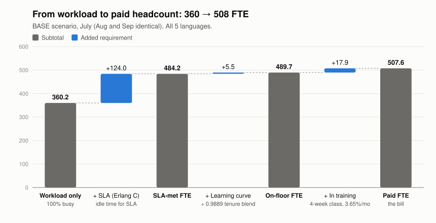
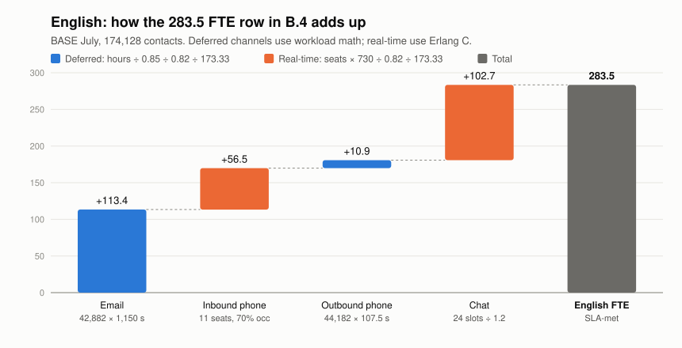

# Understanding the numbers — how volume becomes FTE (plan_claude.md §B.4)

B.4 takes the volumes from B.3 and turns them into FTE using **two different methods, depending on the channel**. The easiest way to follow it is to work through one row, **English**, from start to finish. Every number below matches the B.4 table and `run_model.py` output.



---

## Step 0 — Where the volume comes from (B.3)

B.4 doesn't calculate any volume itself. It takes the BASE forecast from B.3:

```
English June actual  158,297  × 1.10  =  174,128 contacts in July
```

That total is then split across the 4 channels using June's channel mix:

| Channel | July contacts | AHT (BPO1/2 blend) |
|---|---|---|
| Email | 42,882 | 1,150 s |
| Inbound phone | 44,182 | 457.5 s |
| Outbound phone | 44,182 | 107.5 s |
| Chat | 42,882 | 1,150 s |

(Inbound = outbound and email = chat because the data mirrors those pairs. That's DQ findings #6 and #7.)

## Step 1 — Contacts → workload hours (the "Email h / Inb h / Outb h / Chat h" columns)

The same formula applies to every channel:

```
hours = contacts × AHT ÷ 3600

Email:    42,882 × 1,150 ÷ 3600 = 13,699 h
Inbound:  44,182 × 457.5 ÷ 3600 =  5,615 h
Outbound: 44,182 × 107.5 ÷ 3600 =  1,319 h
Chat:     42,882 × 1,150 ÷ 3600 = 13,699 h
```

This is total agent handle time for the month. From here the channels go down two different paths.

---

## Path A — Deferred channels (Email, Outbound): workload math

Nobody is waiting live on these channels, so there's no queue to model. You just add some slack (85% occupancy) and shrinkage:

```
FTE = hours ÷ 0.85 (occupancy) ÷ 0.82 (shrinkage) ÷ 173.33 (hours per FTE)

Email:    13,699 ÷ 0.85 ÷ 0.82 ÷ 173.33 = 113.4 FTE
Outbound:  1,319 ÷ 0.85 ÷ 0.82 ÷ 173.33 =  10.9 FTE
```

---

## Path B — Real-time channels (Inbound, Chat): Erlang C

On these channels a customer is waiting, so enough agents have to be free at every moment to answer 80% within 20 s (phone) or 60 s (chat). Total hours alone can't tell you that. You need to know how busy the line is at any given moment.

**1. Convert monthly hours into "how many agents are busy on average right now" (erlangs):**

```
Inbound: 5,615 h ÷ 730 h in the month = 7.69 erlangs
```

On average, 7.69 calls are in progress at any moment, 24/7.

**2. Erlang C gives the number of seats that must be manned at all times to hit 80/20:**

```
7.69 erlangs, AHT 457.5 s, target 80% in 20 s  →  11 seats  (achieves ~83%)
```

7.69 agents wouldn't be enough, and neither would 8: calls arrive randomly, and bursts would blow the 20 s target. You need 11.

**3. Occupancy column = how busy those seats really are:**

```
7.69 ÷ 11 = 70%
```

The other 30% is idle time. That idle time *is* the service level: agents are free when the next call arrives.

**4. Seats → FTE.** Those 11 seats have to be covered every hour of the month:

```
11 seats × 730 h = 8,030 seat-hours
÷ 0.82 shrinkage = 9,793 paid hours
÷ 173.33         = 56.5 FTE
```

**Chat works the same way, with one extra step for concurrency:**

```
13,699 h ÷ 730 = 18.77 erlangs  → Erlang C at 80/60 → 24 conversation slots
Occupancy: 18.77 ÷ 24 = 78%
Agents: 24 slots ÷ 1.2 chats per agent = 20 agents
FTE: 24 × 730 ÷ 0.82 ÷ 173.33 ÷ 1.2 = 102.7 FTE
```

---

## Step 2 — Add it up



```
English: 113.4 (email) + 56.5 (inb) + 10.9 (outb) + 102.7 (chat) = 283.5 FTE
```

Do the same for the other 4 languages and the total is **484.2 FTE (SLA-met)**.

## Why the small languages look odd

Take German inbound: 917 h ÷ 730 = 1.26 erlangs. Barely one call at a time, but Erlang still needs **3 seats** to answer 80% in 20 s, around the clock. Occupancy is 1.26 ÷ 3 = 42%. Each of the 4 non-English languages pays this minimum on its own, which is why pooling them (Strategy 1 in B.5) saves 51 FTE.

## Where 360 vs 484 vs 508 comes from (the first chart)

| Step | FTE | What it adds |
|---|---|---|
| Workload only | 360.2 | All hours ÷ 0.82 ÷ 173.33, as if agents were 100% busy |
| + SLA (Erlang C) | +124.0 | Idle time on real-time queues so 80/20 and 80/60 are met |
| **SLA-met FTE** | **484.2** | |
| + Learning curve | +5.5 | ÷ 0.9889: new hires handle contacts more slowly (120/110/105% AHT) |
| On-floor FTE | 489.7 | |
| + In training | +17.9 | 3.65%/mo attrition backfilled; the 4-week class isn't producing |
| **Paid FTE** | **507.6 ≈ 508** | The bill |

The 124 FTE gap is the cost of the service level (+34%).

---

## The open question: "One number needs an owner — ±78 FTE"

This is the riskiest single number in the plan — worth walking through carefully.

### The two numbers, and what they actually are

The workbook contains **an assumption and an actual**, from two different sheets:

| Sheet | What it is | Value |
|---|---|---|
| `AHT Assumptions by BPO and lang` | A **static planning table** — one number per BPO × language × channel, no dates, not a time series | **709.78 s** (English, all 4 channels blended, June mix) |
| `EN AHT by Contact reason` | A **real monthly time series**, Jan–Jun, built bottom-up from ticket-level reason codes | **908.78 s** (Apr–Jun average) |

The sheet names say it plainly: one is literally called "Assumptions" (a planning input, static, presumably set once); the other is observed ticket data that moves month to month. That's a legitimate reason to ask: *is actual handle time simply running ahead of what was planned?*

### Checking that directly — it isn't AHT drift

The assumption sheet is a blend across **all four channels**, including outbound (107.5 s, ~25% of English volume, very cheap). The reason-level sheet is built from **reason codes**, a ticketing-system concept — outbound phone calls almost certainly aren't in that population at all.

So the fair comparison isn't "709.78 vs 908.78" — it's the assumption recomputed over the **same three channels** the actual figure covers (email, inbound, chat — no outbound), using the same channel weights:

```
(email 42,882×1,150 + inbound 44,182×457.5 + chat 42,882×1,150) / 129,946 = 914.6 s
```

**914.6 s (assumption, matched channels) vs. 908.78 s (actual, Apr–Jun) — under 1% apart.**

Once the channels match, actual ticket-handling performance is tracking the assumption almost exactly. There's no sign AHT is drifting worse than planned — so **"budget 78 more FTE unless AHT improves" isn't the right conclusion**; there's nothing here to improve.

### So what is the 78 FTE actually about?

Not AHT performance — **channel scope**. The two numbers only diverge because one includes outbound and the other structurally can't:

- Include outbound in the blend (709.78 s, all 4 channels) → **508 FTE**
- Exclude it (908.78 s, ticket-channels only) → **585 FTE**

The real open question is narrower than "which AHT is correct" — it's **whether outbound English calls belong in the capacity plan at all**. That question is sharpened by a separate data-quality finding: English inbound and outbound volumes are near-identical in 29 of 30 language-months, which is the signature of a **mirrored/synthetic column**, not independently measured outbound activity. If outbound isn't real volume, the 709.78 s blend is overstating what a genuine 4-channel AHT would be, and the reason-level, ticket-only figure may be closer to the right planning basis after all — for a different reason than "AHT got worse."

### Why channel-level (508) was still picked as the working default

1. **It's channel-resolved.** Erlang C needs separate AHT for inbound and chat (different SLA targets, different math) — a single blended reason-level number can't be split that way.
2. **It's the only method consistent across all 5 languages.** Every other language only has channel-level AHT; using reason-level uniquely for English would mix methodologies.
3. **It's what you'd put in a BPO contract** — vendors are priced and measured by channel, not by reason code.

But the honest framing for the open question is **"is outbound real, and should it be in scope?"** — not "is AHT underperforming assumption." The plan carries the 585 figure forward as **Open Question #1**, priced, so whoever owns outbound volume and the AHT definition can resolve it before the next cycle.

---

*Charts are generated by `figures/make_waterfalls.py` (stdlib only): `python3 figures/make_waterfalls.py figures`. Build-up values come from `.venv/bin/python run_model.py` (BASE, Jul).*
